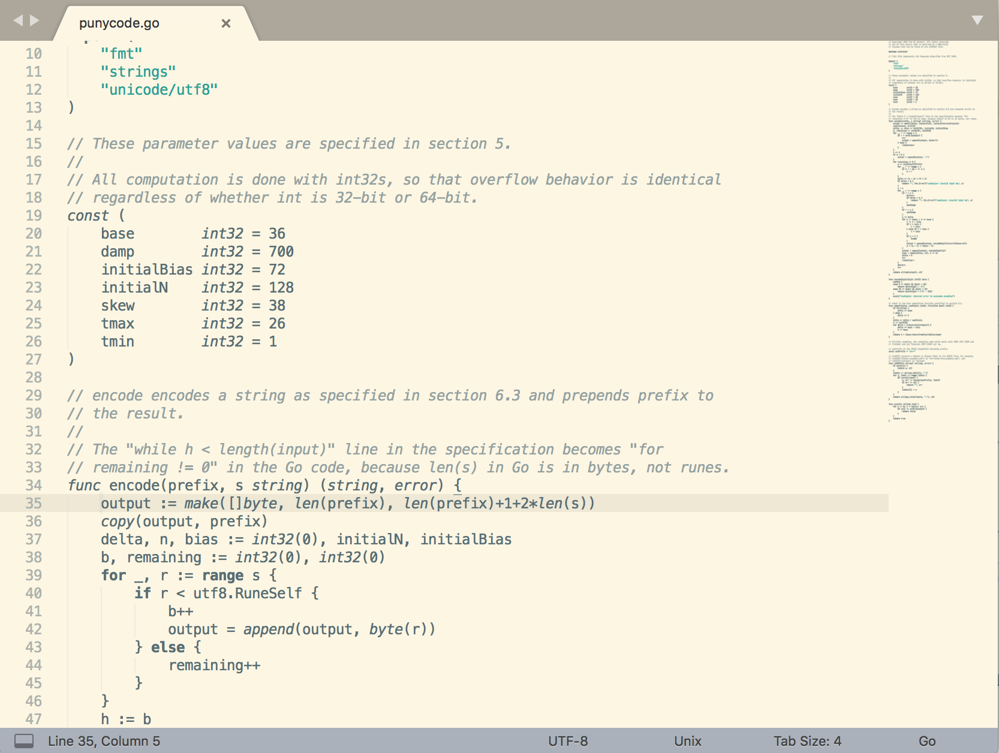

# Minimalist color schemes

The following color schemes are simplifications of the *Solarized light/dark* and the *Breakers* schemes for Sublime Text 3 and other editors using the TextMate theme format. Why these? These are my favorites.

The purpose was to make a color scheme for the Go language without visual noise but keep some highlighting. It may work with other languages.

Comments and strings are colored other syntax elements are highlighted with bold or italic style. The markup styles were kept from the *Breakers* scheme mainly for markdown texts. The example code is from the Go standard library.

## Breakersmin

## Solarizedmin-light

## Solarizedmin-dark

